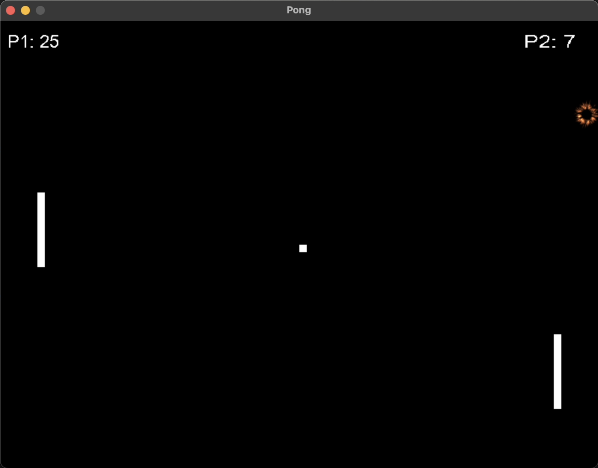

# hello_sdl : pong

This repository contains pong writen using SDL2.  


## Dependencies
The cmake build instructions assume you are running on a Mac OS and installed the following packages using `brew install`.

```
brew install sdl2
brew install sdl2_ttf
brew install sdl2_image
```

## Building & Running
Application exectuable can be made and run with cmake instructions like so
```
mkdir build
cd build
cmake .. 
make
./hello_sdl
```

## Controls
| Command       | Button     |
|---------------|------------|
| Player 1 Up   | W          |
| Player 1 Down | S          | 
| Player 2 Up   | Up Arrow   | 
| Player 2 Down | Down Arrow | 
